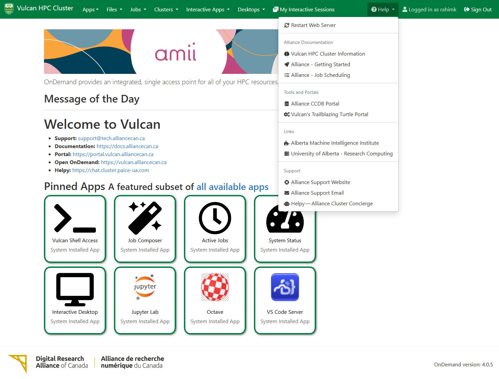

# Vulcan Open OnDemand Deployment

**Maintained by:** Rahim Khoja ([khoja1@ualberta.ca](mailto:khoja1@ualberta.ca))

---

## Description

This repository contains the complete configuration files, scripts, and application definitions for deploying **Open OnDemand (OOD) on the Vulcan HPC cluster** - a Digital Research Alliance of Canada compute resource operated by **[AMII (Alberta Machine Intelligence Institute)](https://www.amii.ca/)** and the **University of Alberta** as part of the PAICE (Platform for Advanced Infrastructure and Computing Excellence) initiative.

The project provides a production-ready, reproducible setup for OOD using Apache, OIDC authentication, and Let's Encrypt SSL. This repository serves as both a working deployment for Vulcan and a comprehensive template that can be adapted for other HPC clusters and institutions.

**Key Features:**
- **Production-ready OOD deployment** with OIDC authentication
- **Pre-configured applications** (Jupyter, RStudio, VS Code, MATLAB, ParaView, etc.)
- **Automated configuration** via cron scripts for cluster discovery
- **Multi-language support** (English-Canadian and French-Canadian)
- **University of Alberta branding** with **[AMII partnership](https://www.amii.ca/)** integration
- **Globus file transfer** integration for high-speed data movement

## Dashboard Screenshot

*The Vulcan Open OnDemand dashboard showing the available applications and cluster resources.*

---

## Documentation

- **[INSTALLATION.md](./INSTALLATION.md)** - Step-by-step installation guide for Ubuntu 24.04
- **[REQUIREMENTS.md](./REQUIREMENTS.md)** - System requirements and prerequisites
- **[CONFIGURATION.md](./CONFIGURATION.md)** - Configuration files and deployment settings
- **[REPOSITORY_STRUCTURE.md](./REPOSITORY_STRUCTURE.md)** - Complete repository structure and components

---

## Quick Start

To deploy this OOD configuration on your cluster:

1. **Review requirements** - Ensure your system meets the prerequisites in [REQUIREMENTS.md](./REQUIREMENTS.md)
2. **Follow installation** - Use the step-by-step guide in [INSTALLATION.md](./INSTALLATION.md)
3. **Customize configuration** - Update settings for your cluster as documented in [CONFIGURATION.md](./CONFIGURATION.md)
4. **Deploy applications** - Copy the pre-configured applications and templates to your OOD installation

**Key Customization Points:**
- **Cluster configuration** - Update hostnames, SLURM settings, and partition names
- **Authentication** - Configure OIDC provider and SSSD integration
- **Branding** - Replace University of Alberta references with your institution
- **Applications** - Modify resource limits and add/remove applications as needed

**Note**: Cluster information (partitions, GPUs, application versions) is automatically generated by cron scripts - no manual editing required.

---

## References

* [Open OnDemand Documentation](https://osc.github.io/ood-documentation/latest/)
* [Digital Research Alliance of Canada](https://alliancecanada.ca/en)
* [Vulcan Cluster Documentation](https://docs.alliancecanada.ca/wiki/Vulcan)
* [PAICE Platform](https://www.ualberta.ca/information-services-and-technology/research-computing/paice)
* [CHPC OnDemand Apps v4](https://github.com/chpc-uofu/ood-ge-apps-v4) - Used as reference for application development and configuration

---

## 🙏 Contributors & Acknowledgments

This project wouldn't have been possible without the generous help and support of many individuals and organizations. Special thanks to:

### 🚀 Key Contributors

- **[Karim Ali](https://github.com/karimali3)** - Development assistance and feedback
- **[Maxime Boissonneault](https://github.com/mboisson)** - JupyterHub and CVMFS expertise
- **[James Willis](https://github.com/james-willis)** - SciNet repository access and collaboration
- **Darren Boss** - Extensive OIDC authentication help and expertise

### 🏛️ Institutional Support

- **SciNet from University of Toronto** - Infrastructure and collaboration opportunities
- **Digital Research Alliance of Canada** - Platform and community support
- **University of Alberta Research Computing Group** - Local infrastructure and resources

### 💬 Community Support

- **Digital Research Alliance of Canada Slack Channel "openondemand"** - All members for their ongoing support and collaboration

### 🔍 Additional Support

The following individuals have provided technical support and feedback to this project:
- **Bart Oldeman** - Technical support and contributions
- **Tyson Whitehead** - Technical support and contributions
- **James Peltier** - Technical support and feedback
- **David Magda** - Technical support and feedback
- **Grigory Shamov** - Technical support and contributions
- **Olexa Bilaniuk** - Technical support and feedback
- **Many Others** - Technical support and feedback

*Note: Some contributors may have profiles on institutional GitLab instances (e.g., git.computecanada.ca, gitlab.rcg.sfu.ca) rather than public GitHub profiles.*

---

## 🤝 Support

Many Bothans died to bring us this information. This project is provided as-is, but reasonable questions may be answered based on my coffee intake or mood. ;)

Feel free to open an issue or email **[khoja1@ualberta.ca](mailto:khoja1@ualberta.ca)** or **[kali2@ualberta.ca](mailto:kali2@ualberta.ca)** for U of A related deployments.

---

## 📜 License

This project is released under the **MIT License** - one of the most permissive open-source licenses available.

**What this means:**
- ✅ Use it for anything (personal, commercial, whatever)
- ✅ Modify it however you want
- ✅ Distribute it freely
- ✅ Include it in proprietary software

**The only requirement:** Keep the copyright notice somewhere in your project.

That's it! No other strings attached. The MIT License is trusted by major projects worldwide and removes virtually all legal barriers to using this code.

**Full license text:** [MIT License](./LICENSE)

## 🧠 About University of Alberta Research Computing

The [Research Computing Group](https://www.ualberta.ca/en/information-services-and-technology/research-computing/index.html) supports high-performance computing, data-intensive research, and advanced infrastructure for researchers at the University of Alberta and across Canada.
